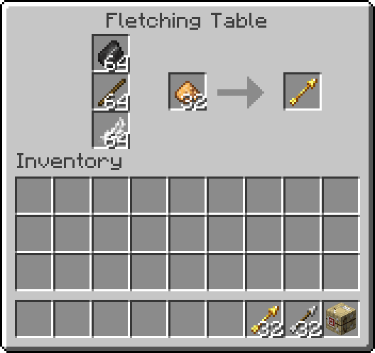

# Fletching Additions

Gives the fletching table functionality!

### What does this mod do?
 Currently this mod just adds basic functionality to the fletching table. 
However, I have plans to add additional arrow types.

### Screenshots below:
  

https://github.com/FrostBird347/Fletching-Additions/assets/39435218/2f28a793-0bb9-48fe-b983-98928f71beba

### What's different between the code on this repo and the last [published version](https://modrinth.com/mod/fletching-additions)?
 You can mix and match materials to craft custom arrow types. Refer to additional the screenshots below for clarification.

### Note for developers
 I initially planned to just get a working prototype out, and to only start tearing my hair out trying to clean up the code once I had all the custom arrow behaviour planned out. As you can probably guess, that was a bad idea. 
I also tackled this project by trying to utilize existing systems as much as possible instead of rewriting large sections of the game. This is why there is a shell script that reads a spreadsheet to generate thousands of recipes and item models.

### Additional experimental code screenshots below:

https://github.com/user-attachments/assets/f05547e3-83fd-4e68-a68e-e0b8c7e282ed

https://github.com/user-attachments/assets/04a95b76-10f1-48e3-8e80-293f47edac4b

https://github.com/user-attachments/assets/d4a6a5d4-3562-4b83-bb21-c2b206843142

https://github.com/user-attachments/assets/3ec1a020-9405-4271-a257-db65eb7ca7c8

https://github.com/user-attachments/assets/8b1d2514-a42d-4029-8cd3-215bbcf082c5

https://github.com/user-attachments/assets/764d3a9b-9fd1-41a7-93a6-b7ee1475d810

https://github.com/user-attachments/assets/6ab2c255-6c21-486e-bdf3-7724540d6627
